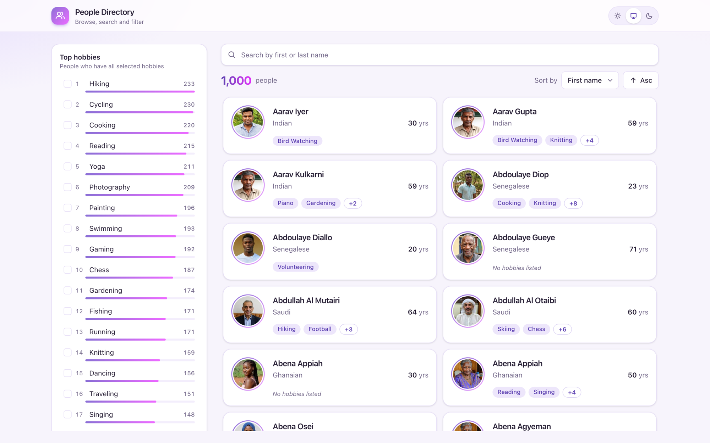
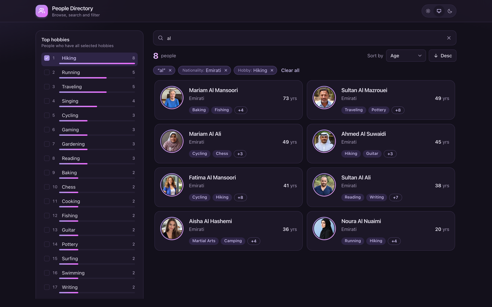
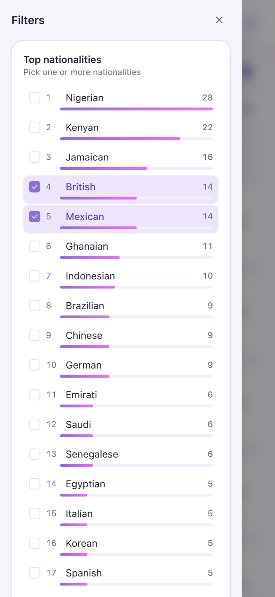

# Presight Frontend Exercise

A full-stack people directory built for the Presight frontend exercise. Users can browse a large, persisted dataset, search by name, narrow results by nationality and hobbies, and sort the results. A sidebar shows the top 20 hobbies and nationalities for the current results, so it is easy to see which filters are useful.

The project is a Yarn workspaces monorepo with a **React** client, a **Node.js (Express)** API and a **SQLite** database as the single source of truth for user data. It can run locally for development or as a single production container with Docker Compose.

## Features

- Virtualized, infinitely scrolling list of user cards using `@tanstack/react-virtual`
- Text search across first and last name, case and accent insensitive
- Nationality filter (matches **any** selected) and hobby filter (matches **all** selected), applied together with the search
- Sorting by first name, last name, age or nationality in either direction, with deterministic ordering
- Sidebar with the top 20 hobbies and nationalities, with counts that follow the active search and filters
- Search, filters and sort kept in the URL, so reloading or sharing a link restores the same view
- Loading, empty and error states, light and dark themes, and a responsive layout for desktop and mobile

## Screenshots

### Scenario 1: Browsing the directory

`/` — the default view with all 1,000 users sorted by first name. The sidebar ranks the top 20 hobbies and, below them, the top 20 nationalities, each with its count. The list loads more cards as you scroll.



### Scenario 2: Search, filters and sort combined (dark theme)

`/?q=al&hobby=Hiking&nationality=Emirati&sort=age&order=desc` — the text search, a nationality filter and a hobby filter apply together, sorted by age from oldest to youngest. The hobby and nationality counts in the sidebar update for the 8 matching users, and each active filter can be removed from the chips above the list. Opening this URL directly restores the same view.



### Scenario 3: Nationality filters on mobile

`/?hobby=Cooking&nationality=British&nationality=Mexican` — on small screens the sidebar moves into a drawer opened from the Filters button. With Cooking selected, the top 20 nationalities show how many people who cook come from each country. Selecting British (14) and Mexican (14) returns the 28 users from either nationality. The nationality counts still list the other countries, so more can be added to the selection.



## Tech stack

| Layer | Technology |
| --- | --- |
| Client | React 19, TypeScript, Vite, Tailwind CSS 4, TanStack Query, TanStack Virtual, React Router |
| API | Node.js, Express 5, TypeScript |
| Database | SQLite through Node's built-in `node:sqlite` module |
| Tooling | Yarn workspaces, Lerna, `node:test`, Docker |

## Prerequisites

- **Node.js 22.13 or newer.** Node 24 is recommended and is pinned in `.nvmrc`. The API uses the built-in `node:sqlite` module, which is not available in older versions.
- **Yarn 1.x** (`npm install -g yarn`)
- **Docker** with Docker Compose v2, only needed for the Docker setup

If you use [nvm](https://github.com/nvm-sh/nvm), run `nvm use` in the project root to switch to the pinned version.

## Running locally

### 1. Setup

```bash
git clone <repository-url> presight-exercise
cd presight-exercise
nvm use          # optional, switches to Node 24
yarn install
```

### 2. Seed the database

```bash
yarn seed
```

This creates `server/data/presight.db` and fills it with 1,000 users. The seed uses a fixed random seed, so it produces exactly the same data every time. Running it again drops and recreates the tables.

Seeding is also automatic: if the database is empty when the API starts, it seeds itself. Use `yarn seed` whenever you want to reset the data.

The database is a regular SQLite file, so you can open it in any SQLite client, such as DBeaver or the `sqlite3` command-line tool.

### 3. Start the application

The quickest way is the development script:

```bash
./dev.sh
```

It selects the right Node version (through nvm when it is installed), installs dependencies if they are missing or out of date, checks that ports 3000 and 4000 are free, and then starts both apps with hot reload.

You can also start the apps with Yarn directly:

```bash
yarn dev
```

| Service | URL |
| --- | --- |
| Client | http://localhost:3000 |
| API | http://localhost:4000/api |

The Vite dev server forwards `/api` requests to the API, so open the client URL in your browser. Press `Ctrl+C` to stop both.

### Development script

`dev.sh` wraps the most common tasks:

| Command | Description |
| --- | --- |
| `./dev.sh` | Start the API and client in development mode (same as `./dev.sh local`) |
| `./dev.sh docker` | Build and run the production app with Docker Compose |
| `./dev.sh test` | Run the test suite |
| `./dev.sh seed` | Recreate and seed the local database |
| `./dev.sh stop` | Stop the Docker container |
| `./dev.sh reset` | Stop Docker and delete both the local and the Docker database |
| `./dev.sh help` | Show all commands |

### Yarn scripts

| Command | Description |
| --- | --- |
| `yarn dev` | API in watch mode and client dev server |
| `yarn seed` | Recreate and seed the SQLite database |
| `yarn test` | Run the API and seed tests |
| `yarn typecheck` | Type-check the client and server |
| `yarn build` | Production build of the client and server |
| `yarn start` | Build, then serve the app from http://localhost:4000 |

## Running with Docker Compose

The Docker image builds the client and server in separate stages and runs the compiled app as a single non-root container. The API also serves the built client, so everything is available on one port.

### Start

```bash
docker compose up --build
```

Or use the development script, which first checks that Docker is running and the port is free:

```bash
./dev.sh docker
```

Open http://localhost:4000. On the first start the container creates the database in the `db-data` volume and seeds it. The data survives restarts and rebuilds.

To run in the background, add `-d` and follow the logs with `docker compose logs -f`.

### Stop

```bash
docker compose down
```

### Reseed the Docker database

Stop the app first, then run the seed inside a one-off container:

```bash
docker compose down
docker compose run --rm app node --disable-warning=ExperimentalWarning server/dist/seed.js
docker compose up -d
```

### Remove everything

```bash
docker compose down -v
```

This removes the container and the database volume. The next start seeds a fresh database.

### Use a different port

```bash
PORT=8080 docker compose up --build
```

The container has a health check on `/api/health`. `docker compose ps` shows the app as `healthy` once it is ready.

### Configuration

| Variable | Default | Description |
| --- | --- | --- |
| `PORT` | `4000` | HTTP port of the API |
| `DB_PATH` | `server/data/presight.db` (`/data/presight.db` in Docker) | SQLite file location |
| `CLIENT_DIST` | unset (`/app/client/dist` in Docker) | When set, the API also serves the built client from this folder |

## API

### `GET /api/people`

| Param | Example | Notes |
| --- | --- | --- |
| `q` | `q=fatima` | Matches first or last name. Every word must match. |
| `nationality` | `nationality=Emirati&nationality=Indian` | Repeatable. People from **any** selected nationality. |
| `hobby` | `hobby=Hiking&hobby=Yoga` | Repeatable. People who have **all** selected hobbies. |
| `sort` | `first_name` | `first_name`, `last_name`, `age`, `nationality` |
| `order` | `asc` | `asc` or `desc` |
| `page` | `1` | Starts at 1 |
| `pageSize` | `30` | 1 to 100 |

```json
{
  "data": [
    {
      "id": 102,
      "avatar": "https://…/male/128/64.jpg",
      "first_name": "Aarav",
      "last_name": "Iyer",
      "age": 30,
      "nationality": "Indian",
      "hobbies": ["Bird Watching"]
    }
  ],
  "page": 1,
  "pageSize": 30,
  "total": 1000,
  "hasMore": true
}
```

### `GET /api/people/facets`

Takes the same `q`, `nationality` and `hobby` params and returns the top 20 values with counts for the current filters.

```json
{
  "total": 58,
  "hobbies": [{ "value": "Hiking", "count": 58 }],
  "nationalities": [{ "value": "Nigerian", "count": 9 }]
}
```

### Errors

Invalid input returns `400` with `{ "error": "…" }`. Unknown API routes return `404`. Unexpected failures return `500` without leaking details.

### `GET /api/health`

Returns `{ "status": "ok" }` once the database answers. The Docker health check uses it.

## Data model

```
people          (id, avatar, first_name, last_name, first_name_norm, last_name_norm, age, nationality)
hobbies         (id, name UNIQUE)
person_hobbies  (person_id, hobby_id, position)   PRIMARY KEY (person_id, hobby_id)
```

- Hobbies are many-to-many, so they live in a join table. Filtering by several hobbies is a `GROUP BY person HAVING COUNT(*) = n`, and the top-20 hobbies are a plain `GROUP BY` over the join table.
- `position` keeps each person's hobby order so the card shows the same first two every time.
- `*_norm` columns hold lowercase, accent-free names. Search and name sorting use them, so `hernandez` finds `Hernández` and `Álvarez` sorts under A.
- Indexes cover each sort column together with `id`, plus the hobby lookup.

### Seed data

The seed is deterministic (fixed faker seed). Each person gets a nationality, a first and last name typical for it, and an AI-generated portrait from the same region and sex. The portraits come from faker's portrait set, which publishes the prompt used for every image; the person's age is taken from that prompt.

## Design decisions

**Pagination.** Results are ordered by the chosen column and then by `id`, in the same direction, so every row has a unique position and offset pagination never repeats or skips a person. The dataset doesn't change while you browse, so offsets are safe. If records could be inserted during a scroll, I'd switch to keyset pagination (`WHERE (sort_col, id) > (?, ?)`).

**Facet counts.** Hobby counts use every active filter, so each count is exactly how many results you'd get by adding that hobby. Nationality counts apply the text and hobby filters but not the nationality selection itself. Nationalities combine with OR, so this keeps the other options visible with useful counts instead of collapsing the list to what is already selected.

**Validation.** Query params are parsed into typed values at the edge, with whitelists for sort fields and limits on page size, search length and the number of filter values. User input only ever reaches SQL as bound parameters. The only interpolated pieces are the sort column and direction, which come from a fixed map.

**Client state.** The URL is the single source of truth for search, filters and sort. Toggling a filter adds a history entry (the back button undoes it), while typing replaces the current entry. React Query caches pages per filter combination, cancels outdated requests, and keeps the previous results visible while new ones load, which avoids flicker.

**Virtualization.** Only the cards in view (plus a small overscan) are in the DOM. On wide screens the list uses two lanes. The next page is requested when the loader row scrolls into view.

**No UI kit.** Styling is Tailwind with CSS variables, so the dark theme is a change of variables rather than duplicated classes. Icons are inline SVG.

## Testing

```bash
yarn test
```

The API tests start the real Express app against an in-memory database seeded with the same data. Rather than hard-coding expected numbers, they load the full dataset and compute the expected result in plain JavaScript, then compare it with what the SQL returns. They cover:

- pagination for every sort field and direction (no duplicates, gaps or ordering errors)
- AND and OR filter semantics, alone and combined
- search across first and last name, case and accent insensitive, with SQL wildcards treated literally
- top-20 counts across several filter combinations
- validation errors and 404s
- deterministic seeding and the data model constraints

## Project structure

```
client/
  src/
    api/          fetch wrappers for the API
    components/   cards, list, sidebar, search, sort, drawer, states
    hooks/        URL state, theme, debounce, element width
    pages/        DirectoryPage
server/
  src/
    db/           schema, seed, nationality and portrait data
    people/       params parsing, SQL queries, routes
    app.ts        Express app (testable, no listen)
    index.ts      startup, auto-seed, graceful shutdown
  test/           node:test suites
docs/
  screenshots/    images used in this README
Dockerfile        multi-stage build, non-root runtime
docker-compose.yml
dev.sh            development script
.nvmrc            pinned Node version
```

